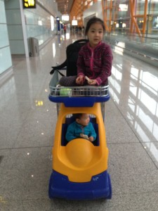

借着出差参加Tokyo OpenStack Summit机会，带着全家第一次游览了日本东京。

- CA 181 08:35 Beijing Capital Apt(T3) 12:50 Tokyo Haneda Apt(I) (4700CNY)
- 10.26 ~ 10.31 品川新高轮王子酒店 (153600 JPY)
- 11.1 ~ 11.3 东京迪斯尼乐园酒店 (57600 + 52500 + 48400=158500 JPY)
- 11.4 ~ 11.5 皇冠花园酒店 (43568 JPY)
- CA 926 15:15 Tokyo Narita Apt(1) 18:20 Beijing Capital Apt(T3)

**10.26 出发**

小胖子第一次出远门

抵达日本羽田机场, 购买西瓜卡,地铁到达品川站, 期间还以为做错车从快车转成了慢车, 然后拖着行李爬了好大一个坡到达开会的酒店品川新高轮王子酒店, 办理入住酒店给免费把双床升级成了三床.

简单休息一下, 去会议check-in, 然后一家人出门超市买晚餐, 晚上参加公司的聚会

**10.27 会议加东京塔**

上午参加会议, 下午会议结束带闺女去了趟东京塔, 晚餐吉野家

**10.28 会议加东京站苹果店**

上午参加会议, 娃们酒店花园逛了一圈, 下午一家人去了东京站附近的苹果店, 先给媳妇配了一台iphone6S, 一风堂吃的拉面

**10.29 会议加台场**

台场购物

**10.30 会议加新宿**

新宿的回转寿司

**10.31 索尼科技馆加台场反斗城**

索尼科技馆游玩, 玩具反斗城奶粉纸尿裤

**11.1 出发迪斯尼乐园**

大包小包地铁出发迪斯尼, 入住迪斯尼乐园酒店, 晚上酒店周边逛, 迪斯尼一风堂

**11.2 迪斯尼乐园**

迪斯尼第一天, 下雨, 迪斯尼乐园一天

**11.3 迪斯尼海洋乐园**

迪斯尼第二天, 迪斯尼sea一天

**11.4 迪斯尼乐园**

迪斯尼乐园第二天, 出发去市区东京站附近的皇冠酒店

**11.5 药妆店,皇居,上野动物园**

**11.6 回家**
