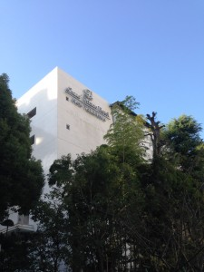
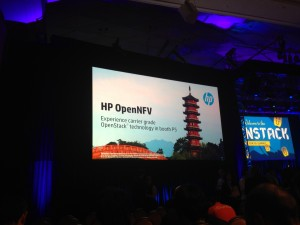
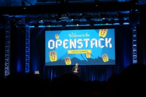
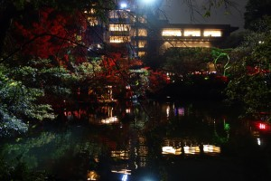
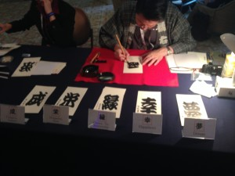

**Day 1**

It's been more than a year to attend Mitaka OpenStack Summit at Tokyo, it's my second OpenStack Summit, it's my first travel after join the new team and it's my first time to visit Tokyo. For Mitaka, the OpenStack Summit is only 4 days long, lasting from Tuesday through Friday. I arrived Tokyo Haneda Airport at the Monday afternoon (2015.10.26) with 3 hours flight from Beijing, then took the keikyu line railway to arrive Shinagawa Station, after about 10 mins walking got to my hotel and OpenStack Summit venue. (Grand Prince Hotel New Takanawa)

After a little rest, I walked over to the HP employee party at a nearby restaurant where I saw my boss first time.

Tuesday was the actual start of the summit. There about 5,000 attendees from 56 countries attend this summit, which makes it the biggest non-North American summit. I attended the keynotes today (all of which are in the video here: [OpenStack Tokyo Summit Full Keynote](https://www.youtube.com/watch?v=fnPj9pQc2L8)). It continues to be inspiring to watch such diverse companies embracing not only the usage of open source and OpenStack, but the contributions back to the community. Jonathan Bryce also talked about the cool new feature on the OpenStack website that takes various metrics and creates a table tracking age, maturity and adoption to help operators evaluate each component, it can be found at: [http://www.openstack.org/software/project-navigator](http://www.openstack.org/software/project-navigator). He also announced an OpenStack certification that was built and developed with some of the training partners and will start being available to take in 2016.

The rest of this day i attended many OpenStack sessions related Infrastructure.

**Day2**

The opening keynotes on Wednesday had a pretty common theme: Neutron. Mark Collier shared that in the Liberty cycle, for the first time Neutron was the most active project in OpenStack. This is really inspiring news for the community, as just two years ago there was concern about the commitment to the project and adoption statistics. Mark went on to share that 89% of respondents to the latest OpenStack User Survey said they’re using Neutron in production. Keynotes continued with former Neutron PTL Kyle Mestery who gave a quick history of Neutron, spoke about design goals and new [Kuryr](https://git.openstack.org/cgit/openstack/kuryr/tree/) project, which focuses on networking for containers. Full video of the keynotes [here](https://www.youtube.com/watch?v=D4FEBdqfaZg).

Today I also join the QA session about the new health dashboard to track problems and failures in our CI system so they can be checked by anyone when a disruption occurs. An initial prototype has been launched, so the discussion centered around the future of scaling the dashboard so it can be introduced to the wider community. This included concerns like backups and bottlenecks like subunit2sql performance fixes. Read-only link to the Etherpad from the session [here](https://etherpad.openstack.org/p/r.014a73fa8b4864e6bba31556c77f42a2).

The official evening party was hold by HP, Scality, Cisco and Bit-isle and took place at the beautiful [Happo-En](http://www.happo-en.com/english/) park. It was a shuttle ride or a 10 minute walk from the venue. The event had several indoor spaces with refreshments and entertainment. It also had a beautiful outdoor space, with a park to walk through, water features, bridges, and a whole fleet of bonsai trees, one of which was 520 years old.

**Day3 and Day4**

I spent the Thursday and Friday focus on the Design Summit and Team meetup. This is my first time to join the design summit.

Also sent a postcard with the Japanese character at the HP lounge.

For lunch I met up with my HP colleagues as we secured two tables in the hot buffet lunch area, It's my first time to meet the whole team and put the IRC nick to a face in several cases.

Friday was contributor meetup day! I would like to join the Infrastructure session but full house.

That's all my Mikata OpenStack Summit!
