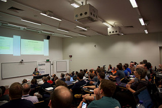

2016.2.1 ~ 2016.2.5, i had the pleasure of attending my first linux.conf.au. This year it took place in Geelong, a very beautiful, small, seaside city, about an hour train ride southwest of Melbourne. I arrived Melbourne on Sunday(1.31) afternoon and took the shuttle bus from Melbourne airport to the conference venue at Deakin University’s Waterfront Campus, after finished the registration and got my badge, then I walked to my hotel along the very beautiful beach.

This evening I met up with a whole bunch of my HPE colleagues for dinner at this restaurant.

Conference began on Monday morning! And today I spent most of time on Open Cloud Symposium miniconf, and join the great sessions like Casey West, [The Twelve-Factor Container](http://lcabythebay.org.au/schedule/30297/view_talk?day=monday) ([video](https://www.youtube.com/watch?v=aPv12drmIqg)) and [Cloud Anti-Patterns](http://lcabythebay.org.au/schedule/30389/view_talk?day=monday) ([video](https://www.youtube.com/watch?v=fV3epaFUEmk)), Steven Ellis, [Cloud Crafting-Public/Private/Hybird](http://lcabythebay.org.au/schedule/30390/view_talk?day=monday) ([video](https://www.youtube.com/watch?v=WQ7eU2mVL0o)).

On Tuesday, first I join the keynote of George Fong ([video](https://www.youtube.com/watch?v=5E589-0kK20)), and following sessions is my like today: Steven Ellis, [Is that a data-center in your pocket?](http://lcabythebay.org.au/schedule/30326/view_talk?day=tuesday) ([video](https://www.youtube.com/watch?v=4ZnvjJSmbO4)) , Joe Gordon, [Keeping Pinterest Running](http://lcabythebay.org.au/schedule/30329/view_talk?day=tuesday) ([video](https://www.youtube.com/watch?v=I68LtSfzofg)),  Tammy Butow, [Site Reliability Engineering at DropBox](http://lcabythebay.org.au/schedule/30330/view_talk?day=tuesday) ([video](https://www.youtube.com/watch?v=ggizCjUCCqE)).  And my US manager's session, [Internet Archive: Universal Access. Open APIs](http://lcabythebay.org.au/schedule/30354/view_talk?day=tuesday) ([video](https://www.youtube.com/watch?v=FHkp3KRisAQ)) _by_ VM Brasseur. And on Tuesday night I join the Professional Delegates' Networking Session (PDNS)  at _Little Creatures Brewery, South Geelong._ Beers and kangaroo meat are all my favorite.

Wednesday also started with the keynote by Catarina Mota ([video](https://www.youtube.com/watch?v=CpYsrpnDtsE)), today's session is [Welcoming Everyone: Five Years of Inclusion and Outreach Programmes at PyCon Australia](http://lcabythebay.org.au/schedule/30210/view_talk?day=wednesday) _by_ Christopher Neugebauer. And Wednesday night was the Penguin Dinner, which is the major, all attendees welcome conference dinner of the event. The venue was The Pier, which was a restaurant appropriately perched on the end of a very long pier.

Thursday's keynote is by Jono Bacon ([video](https://www.youtube.com/watch?v=LToxpzWcMxc)), and today I joined my HPE college Elizabeth K. Joseph's session, [Open Source Tools for Distributed Systems Administration](http://lcabythebay.org.au/schedule/30122/view_talk?day=thursday) ([video](https://www.youtube.com/watch?v=yu0PFfbldNU), [slides](http://princessleia.com/presentations/2016/lca2016-tools-for-open-source-sysadmin.pdf)).

 Photo by Masayuki Igawa ([source](https://www.flickr.com/photos/masayun/24900498966/))

The last day of this week is started with keynote by Genevieve Bell ([video](https://www.youtube.com/watch?v=QqADuKyBNMc)), an Intel fellow with a background in cultural anthropology. The last day ended with the Lightning Talks and Conference Closing that included raffle prizes, thanks to everyone and the hand-off to the team running LCA 2017 in Hobart next year.

This is my first trip for LCA, it's great conference I have joined, it's wonderful experience, I hope I can come in next year!
