**Day 0**

It’s been a long time to write this post after the Austin OpenStack Summit, but I hope to keep all memories of this trip.  It’s my third OpenStack Summit, this time the Summit happened at Austin Texas on April 25 to April 29, 2016 . This is my second time been to the US and first time been to Austin Texas.

I arrived Austin at Sunday (April 24) afternoon, dropped my bags at hotel and went to the convention center to pick up my badge and T-shirt before many people come in the Monday morning. Met my colleague Craige at  the convention center.

My third OpenStack Summit badge

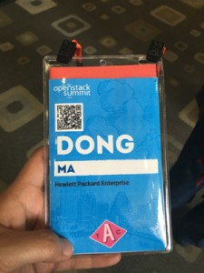

Then I got a time taking a quick tourist of Austin around the convention center, walk at the Colorado riverside and visit the Capital of Texas State.

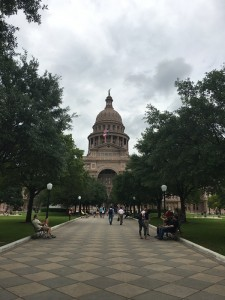

I am very happen to meet my old colleague Dan and have dinner with him at the iron cactus mexican restaurant, try grill and margarita.

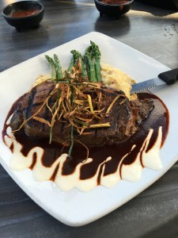 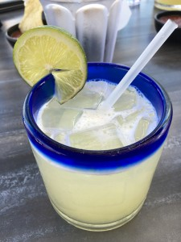

**Day 1**

The first day began with the live music from the band [Soul Track Mind](http://www.soultrackmind.com/). This is first time OpenStack Summit start with the live music show, it’s fun.

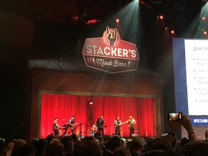

Jonathan Bryce, Todd Morey and Lauren Sell of the OpenStack Foundation opened the conference and gave a tour of numbers. The first OpenStack summit was held in Austin just under six years ago with 75 people and they were proud to announce that this summit had over 7,500 people registered. In Jonathan’s keynote we were able to get into the real users of OpenStack, with highlights including the fact that 65% of respondents to the recent OpenStack User Survey are using OpenStack in production and that half of the Fortune 100 companies are using OpenStack. The video from his keynote is here: [Embracing Datacenter Diversity](https://www.youtube.com/watch?v=d1n4qf1bN7g).

The first day keynote session by AT&T, Mirants, SAP, Redhat and Volkswagen Group. The most interested for me is from Volkswagen Group([Driving the Future of IT Infrastructure at Volkswagen Group](https://www.youtube.com/watch?v=HL_pzkDnal4)). Also announced the superuser awards to AT&T, the keynote sessions concluded with the announcement of the 2017 OpenStack Summit locations: Boston and Sydney!

After the keynote sessions, I joined the session of OpenStack-Health Dashboard and Dealing with Data from the Gate by Matthew Treinish, he talked about the openstack-health dashboard, how it works, it’s current limitations, and the future of the project. It’ll also cover some related tools that are available and how they all fit together, and how you can use everything together to take a more data driven approach to analyze and test OpenStack with the gate.

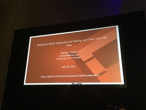

After lunch, I went to the talk “OpenStack Stable: What It Actually Means to Maintain Stable Branches” by Matt Riedemann, Matthew Treinish and Ihar Hrachyshka in the Upstream Development track of the conference. The goal of this talk was to inform members of the community what exactly is involved in management of stable releases, which has a lot more moving pieces than most people tend to expect. Video from the session up [here](https://www.youtube.com/watch?v=2agiBu081sw).  Next is “OpenAPI as a Standard – A New Way Forward for API Documentation, Design and Tool” by Ken’ichi Ohmichi, Motohiro Otsuka, Anne Gentle and Alex Xu, this talk provides the overview of Swagger, how to apply Swagger to each project, and merit for clients. Video of this session [here](https://youtu.be/10VoLqOlFsU).

Next I joined is “[Hunting for Purple Squirrels: Hiring OpenStack Contributors in the Wild](https://youtu.be/fXXH-DWf03A)” by Colette Alexander, She talked about the tips and tricks for screening and interviewing so you can get the best candidates for your team. She also talked about the traits and skills that are the best indicators for success for someone new to the OpenStack community, and what red flags to watch out for in interviews. The hiring process is daunting, but you’ll leave this talk re-charged and ready to go find some purple squirrels!

 

The last session joined in a series of great Lightning Talks. Elizabeth K. Joseph gave a tour of [status.openstack.org](http://status.openstack.org/). Continued with talks by Paul Belanger on [Grafyaml](http://docs.openstack.org/infra/grafyaml/), James E. Blair on [Gertty](https://git.openstack.org/cgit/openstack/gertty/tree/README.rst) and Andreas Jaeger on the steps for [adding a project](http://docs.openstack.org/infra/manual/creators.html) to OpenStack. Video of all the lightning talks [here](https://www.youtube.com/watch?v=JUUrAv9vSb0).

The last part today is the happy hour at the Market place, food, beer and music, visit sponsor’s booth for T-shirt and gifts.

**Day 2** 

Day two of the summit also began with live music. Mark Collier of the OpenStack Foundation kicked off by talking about to manage the increased  billions of devices infrastructure, new tools and patterns will be required which can handle bare metal, virtual machines, and containers, The opportunity is massive, but it will require collaboration across many open source communities, always mindful of what our users want and need, because it’s collaborate or die in the billion device, billion core era. video[here](https://www.youtube.com/watch?v=s-k-RenOczU).

The highlights of the keynotes today included a talk about Building a SmartCity with IoT. Video of the presentation [here](https://www.youtube.com/watch?v=Ym_CZ8-crD8). Improving user experience(UX) with OpenStackClient by Dean Troyer, The video from the talk is [here](https://www.youtube.com/watch?v=5MbLKxqDvsA). And OVH presented its high-performance and large-scale OpenStack-based cloud that efficiently combines dedicated and shared resources. And also Lew Tucker, Cisco’s CTO of Cloud Computing, will address Cisco’s continued commitment to OpenStack and discuss how the technology is evolving to usher in a new era of developer-driven, software-defined applications and services.

After these keynote sessions, I began my first Design Summit sessions. Tuesday is for the cross-project sessions.

I joined following cross-project sessions:

- Cross Project workshops: Deployment tools discussion
- How to improve the situation around global requirements
- Stable Branch End of Life Policy
- The future of baremetal networking

There is another session related split event I didn’t join, copy the content from my colleague’s blog post:

_“Brainstorm format for design summit split event” session that talked a lot about dates. As a starting point, Thierry Carrez wrote a couple blog posts about the proposal to split the design summit from the user summit:_

- _[Splitting out the OpenStack Design Summit](http://ttx.re/splitting-out-design-summit.html)_
- _[How splitting the Design Summit enhances the development process](http://ttx.re/how-splitting-enhances-dev-process.html)_

_With these insightful blog posts in mind, the discussion moved forward on the assumption that the events would be split and how to handle that timing-wise. When in the cycle would each event happen for maximum benefit for our entire community? In the first blog post he had a graphic that had a proposed timeline, which the discussions mostly stuck to, but dove deeper into discussing what is going on during each release cycle week and what the best time would be for developers to gather together to start planning the next release. While there was good discussion on the topic, it was clear that there continues to be apprehension around travel for some contributors. There are fears that they would struggle to attend multiple events funding-wise, especially when questions arose around whether mid-cycle events would still be needed. Change is tough, but I’m on board with the plan to split out these events._ 

Tuesday’s evening I joined the StackCity Community Party.  Instead of individual companies throwing big, expensive parties, a street was rented out and companies were able to sponsor the bars and eateries in order to throw their branded events in them. But I didn’t get any thing to eat as most of the party is beer, I stay here about 1 hours and went with my colleague for another delicious dinner.

      

 

**Day 3**

Design Summit day of Infrastructure and QA

All the Wednesday, I joined the Design Summit of Infrastructure and QA sessions. Today’s first session was discussing the Community Task Tracking. A status update on Storyboard and Maniphest, and the road ahead for OpenStack community task, bug and incident tracking. Copied of the pros and cons of Storyboard and Maniphest:

|  | **Pros** | **Cons** |
| --- | --- | --- |
| **Storyboard** | Strong influence over direction, already running and being used in our infra, good API | We need to invest in development ourselves, little support for design/UI folks (though we could run a standalone Pholio) |
| **Maniphest** | Investment is made by a large exiting development team, feature rich with pluggable components like Pholio for design folks | Little influence over direction (like with Gerrit), still have to stand up and migrate to, weak API |

The session didn’t end with any selection, Session etherpad [here](https://etherpad.openstack.org/p/r.46d96ace0361ead94e56d9fe181c5802).

Next session I joined was the QA track about the devstack roadmap, Quick update on the progress of the Neutron refactor, discuss some of the issues discovered while doing the refactor, and plans to finish the refactor. Session etherpad [here](https://etherpad.openstack.org/p/r.06a005b7497d8ad3d837fb80f68cf1e6).

Next one also the QA track about How to accelerate to apply tempest.lib to each project? What’s necessary for a tempest plugin? Etherpad: [here](https://etherpad.openstack.org/p/newton-qa-tempest-lib-and-tempest-plugin)

The last one in the morning was Infrastructure: Landing Page for Contributors. The current pages were on the wiki, like the [Main page](https://wiki.openstack.org/wiki/Main_Page) and the [How To Contribute wiki](https://wiki.openstack.org/wiki/How_To_Contribute) aren’t the most welcoming of pages. This session talked through a lot of the tooling that could be used to make a more inviting, approachable page. Session etherpad [here](https://etherpad.openstack.org/p/r.7c398b6a12472afa0bda754f279f29ea).

In the afternoon, I just joined one QA session about OpenStack Health lead by Matthew Treinish, to discuss the current needs for the project and how to address outstanding issues like bringing in check queue data, how to handle DB scaling, etc. Session etherpad [here](https://etherpad.openstack.org/p/newton-qa-openstack-health)

After that I have a great conversion and coffee with Vicky (Our US team manager), talked about the team status, work, presentation, Vicky suggested a great idea about present at LCA 2017 about Open Source projects contributions for none english native person.

Today’s evening I had a chance to join the core reviewers dinner sponsored by HPE each summit as the greeting  guys with my boss Allison. The dinner was at the very beautiful place and had chance to talk with many core reviewers.

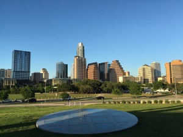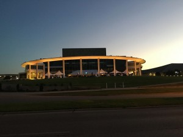

Conclude today with Austin’s beautiful night view

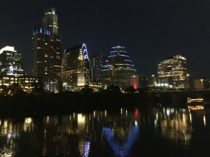

 

**Day 4**

Started in Thursday, I joined a session about “Application CI/CD on OpenStack – Building a Solution Using Jenkins and OpenStack Solum”, Continuous integration and continuous delivery are important aspects in today’s agile and iterative application development methods. Systems such as Jenkins have become pillars of the continuous integration movement providing a general framework to run application-specific tests. On the other hand, continuous delivery has always remained as a challenge. This is especially true if the deployment target is an OpenStack environment which involves several moving parts. In this talk we will present a CI/CD solution that we have built using Jenkins for CI and OpenStack Solum for CD for testing and deploying applications to OpenStack clouds.

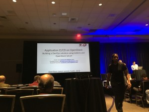

Then back to the Design Summit for Infrastructure was a fishbowl session about OpenID/SSO for Community Systems. The OpenStack Foundation invested in the development of OpenStackID when few other options that fit our need were mature in this space. Today we have the option of using [ipsilon](https://fedorahosted.org/ipsilon/), which has a bigger development community and is already in use by another major open source project (Fedora). The session outlined the benefits of consuming an upstream tool instead, including their development model, security considerations and general resources that have been spent to roll our own solution. The session also outlined exactly what our needs are to move all of our authentication away from Launchpad hosted by Canonical. Session etherpad [here](https://etherpad.openstack.org/p/r.2d4344187e0d3d899fd4912bb03625ac).

Next session was QA: DefCore and Interoperability Testing, The DefCore Working Group is formalizing the requirements for what an interoperable test is. With the successful history of collaboration between the QA and DefCore teams, this working session is targeted towards building that relationship and planning for working on short and long term test issues. This includes identifying work items for currently flagged tests, planning for the refactoring of existing tests to meet DefCore test requirements (including removing unnecessary admin privileges where possible), and long term planning for the augmentation of existing tests and creation of new tests for verifying cloud interoperability.”

The last one I joined today was QA: Newton cycle priorities, this session is to discuss, evaluate, and agree up the list of work item priorities for the Newton cycle. Etherpad: [here](https://etherpad.openstack.org/p/newton-qa-newton-priorities)

 

**Day 5**

The last day was the day for team work session gatherings. Jeremy Stanley (fungi) kicked the day off by outlining topics for Infra and QA that we may find valuable to work on together while we were in the room.

[Infra etherpad](https://etherpad.openstack.org/p/infra-newton-summit-planning) and [QA etherpad](https://etherpad.openstack.org/p/newton-qa-contributors-meetup)

I also got chance to meet with the jenkins-job-builder cores Wayne, Thanh and Khai, to talk about the jjb planning and jjb-2.0. Also in Austin Summit, I first time to meet Jeblair and Monty.

I concluded my Austin Summit with the special bar in Austin airport.

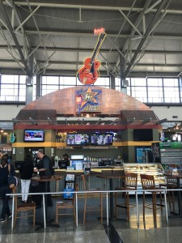

**NOTE**: Infrastructure PTL Jeremy Stanley has also written summaries of sessions here:[Newton Summit Infra Sessions Recap](http://lists.openstack.org/pipermail/openstack-dev/2016-May/094540.html)
